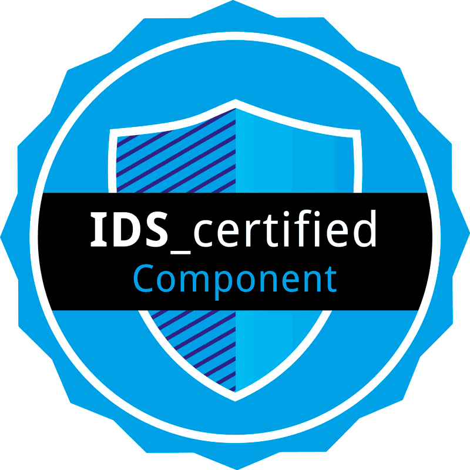

   <strong> Version 1.0.8 </strong>

  

<h1>
TRUE ('TRU'sted 'E'ngineering) Connector for the IDS (International Data Space) ecosystem 
</h1>

	

        The International Data Spaces Association (IDSA) announces the successful completion of IDS certification for Engineering Group’s TRUE Connector as the fourth connector that receives the [IDS Certificate.](doc/IDSA_certificate_ENG_final.pdf)
 
The TRUE Connector is developed by Engineering, a leading digital transformation company based in Italy. The connector is an open-source solution designed to enable self-determined data sharing while ensuring compliance with regulations such as GDPR. Initially focused on the manufacturing domain, the TRUE Connector has proven its versatility across diverse sectors including circular economy, energy, smart buildings, and agri-food domains.
 
The certification process, overseen by IDSA and conducted by the independent evaluation facility SQS, ensures adherence to highest functionality and security standards.
      

	

		
	

The TRUE Connector is composed of three components:

* [Execution Core Container (ECC)](https://github.com/Engineering-Research-and-Development/true-connector-execution_core_container), open-source project designed by ENG. It is in charge of the data exchange through the IDS ecosystem representing data using the IDS Information Model and interacting with an external Identity Provider. It is also able to communicate with an IDS Broker for registering and querying information.
* [Back-End (BE) Data Application](https://github.com/Engineering-Research-and-Development/true-connector-basic_data_app), open-source project designed by ENG. It represents a trivial data application for generating and consuming data on top of the ECC component.
* [Usage-Control (UC) Data Application](https://github.com/Engineering-Research-and-Development/true-connector-uc\_data\_app\_platoon), a customized version of the Platoon base application for integrating Usage Control functionality. This version of Usage control application requires persistence layer, and it this setup, it is H2 in memory database, with file persistence, but if required, it can be changed with PostgreSQL database.

## Table of Contents

Please [click here](https://engineering-ing-inf-rd.gitbook.io/true-connector/), referring to gitbook for a more readable documentation.

* [TRUE Connector](<README.md#true-connector>)
  * [Table of Contents](<README.md#table-of-contents>)
    * [Prerequisite](doc/TRUEConnector/prerequisite.md)
    * [Introduction](doc/TRUEConnector/introduction.md)
    * [System requirements](doc/TRUEConnector/system-requirements.md)
    * [Volumes](doc/TRUEConnector/volumes.md)
    * [Default configuration](doc/TRUEConnector/default-configuration.md)
    * [Starting and stopping containers](doc/TRUEConnector/start-stop.md)
    * [Component overview](doc/TRUEConnector/component-overview.md)
  * [REST API](doc/rest-api.md)
  * [Connector reachability](doc/connectorReachability/reachability.md)
    * [Connector ID](doc/connectorReachability/connectorID.md)
  * [How to Exchange Data](doc/exchange-data.md)
  * [Modifying configuration](doc/modifyingConfiguration/modify-configuration.md)
    * [Enable hostname validation](doc/modifyingConfiguration/hostnamevalidation.md)
    * [SSL/HTTPS](doc/modifyingConfiguration/ssl.md)
    * [Change message format - Multipart/Mixed, Multipart/Form, Http-headers](doc/modifyingConfiguration/messageformat.md)
    * [WebSocket configuration (WSS)](doc/modifyingConfiguration/wss.md)
    * [IDSCPv2 configuration](doc/modifyingConfiguration/idscp2.md)
  * [Advanced configuration](doc/advancedConfiguration/advanced-configuration.md)
    * [OCSP](doc/advancedConfiguration/ocsp.md) 
    * [Supported Identity Providers](doc/advancedConfiguration/identityproviders.md)
    * [Extended jwt validation](doc/advancedConfiguration/extendedjwt.md)
    * [Convert keystorage files](doc/advancedConfiguration/convert_keystorage.md)
    * [Validate protocol](doc/advancedConfiguration/validateprotocol.md)
    * [Clearing House](doc/advancedConfiguration/clearinghouse.md)
    * [Broker](doc/advancedConfiguration/broker.md)
    * [Usage Control](doc/advancedConfiguration/usagecontrol.md)
    * [MyData Usage Control](doc/advancedConfiguration/mydata.md)
    * [Audit logs](doc/advancedConfiguration/auditlogs.md)
    * [Firewall](doc/advancedConfiguration/firewall.md)
  * [Contract Negotiation - simple flow](doc/contractNegotiation/contract-negotiation.md)
    * [Get offered resource](doc/contractNegotiation/get_offered_resource.md)
    * [Description Request Message](doc/contractNegotiation/description_request_message.md)
    * [Contract Request Message](doc/contractNegotiation/contract_request_message.md)
    * [Contract Agreement request](doc/contractNegotiation/contract_agreement_request.md)
    * [Get offered resource after access is granted](doc/contractNegotiation/get_offered_resource_granted.md)
  * [Self Description API](doc/selfDescriptionAPI/self-description-API.md)
    * [Changing API password](doc/selfDescriptionAPI/changepassword.md)
  * [Postman collection](doc/selfDescriptionAPI/postman.md)
  * [User management](doc/user_management.md)
  * [Backup & restore](doc/backupAndUpdate/backup.md)
  * [Updating](doc/backupAndUpdate/update.md)
  * [Docker image signing and verification](doc/cosign.md)
  * [Life cycle](doc/life_cycle.md)
  * [Security](doc/security.md)
  * [Roadmap](doc/roadmap.md)
  * [Traceability matrix](doc/traceability_matrix.md)
  * [License](doc/license.md)
  * [Contributing TRUE Connector](doc/contributingTC.md)