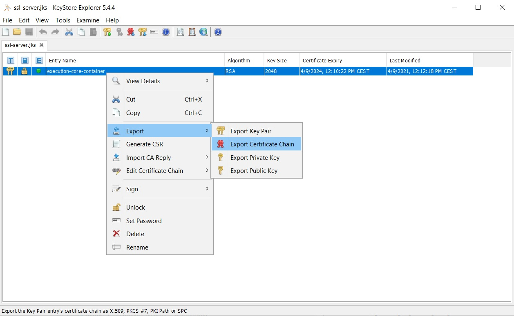
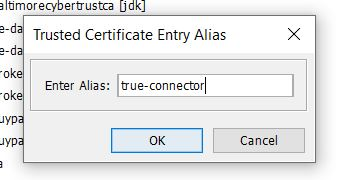

#Testbed 

For more information follow the link [Testbed](https://github.com/International-Data-Spaces-Association/IDS-testbed)

Clone or download this repo. Currently verified version of the Testbed is 1.0.

## Preconfigure

### Generate DAPS certificate using Omejdn DAPS

This step is not mandatory, since Testbed comes with some generated certificates which can be used.

If you want to create new certificate, please follow [instructions](https://github.com/International-Data-Spaces-Association/IDS-testbed/tree/master/CertificateAuthority) provided by Testbed, on how to achieve this.


### DAPS certificate

You can use certificate already provided in Testbed project, in following location - *IDS-testbed\CertificateAuthority\data\cert\*

For this setup, we used testbed3.p12 file. Copy this file to trueconnector\ecc_cert folder.


### TrueConnector properties

Make sure that following properties are configured for Testbed environment:

**.env** 

```
### PROVIDER Configuration
PROVIDER_DAPS_KEYSTORE_NAME=testbed3.p12
PROVIDER_DAPS_KEYSTORE_PASSWORD=password
PROVIDER_DAPS_KEYSTORE_ALIAS=1

PROVIDER_MULTIPART_EDGE=form
```

**application.properties** for both consumer and provider

```
application.isEnabledDapsInteraction=true

#Omejdn 
application.dapsUrl=http://omejdn/auth/token
application.dapsJWKSUrl=http://omejdn/auth/jwks.json

application.encodeDecodePayload=true

application.isEnabledUsageControl=true
application.usageControlVersion=platoon

```

**dataApp application.properties**

```
application.encodePayload=true
```

### Docker networking

Since we are running 2 separate docker containers, one for Testbed and other for TrueConnector, we must connect those 2 environments, so that they could communicate, and "see each other". For example, DAPS is mandatory service, for both environments and it is deployed in Testbed docker container, and by default, not reachable in TrueConnector.

In Testbed docker setup, there is network created, in docker-compose.yml.

```
networks:
  local:
    driver: bridge
```

This network needs to be added in TrueConnector docker compose, so that 2 ecosystems can communicate with each other.</b>
Modify TrueConnector docker-compose.yml file and add following at the end of the file:

```
networks:
  tc-network:
    external: true
    name: testbed_local

```

And also for each service, add it to the network, by simply adding:

```
    networks:
      - tc-network
```

Or you can use already pre-configured docker compose file named *docker-compose-testbed.yml*

### Export TrueConnector certificate

Open *ssl-server.jks* file from TrueConnector/ecc_cert folder using KeyStore Explorer and export certificate (right click on entry name):



and provide location where to save exported certificate. It will be needed in next step, to update DSC truststore.


### Updating DSC truststore

Open DSC truststore file *truststore.p12* using KeyStore Explorer and import TrueConnector certificate, so that DSC can make https calls towards TrueConnector provider


and provide alias *ecc-provider*



This will be used when DSC makes https request towards ecc-provider, to check hostname with imported certificate.


## Configuration

## TrueConnector as consumer

Once both docker compose files are up and running, you can start postman, import Testbed postman connection  from Testbed project(TestbedPreconfiguration.postman_collection.json) and execute several requests (until Register connector), to setup DSC connector:


This will create contract offer, resource and artifact into DSC connectora (provider)

### Description Request Message - get Self Description from DSC connectorA

```
curl --location --request POST 'https://localhost:8084/proxy' \
--header 'Content-Type: application/json' \
--data-raw '{
    "multipart": "form",
    "Forward-To": "https://connectora:8080/api/ids/data",
    "messageType":"DescriptionRequestMessage"
}'
```

This request should return following response:


In payload part of the response, find catalog, and get URL, and update initial request, add requestedElement, like following:

```
curl --location --request POST 'https://localhost:8084/proxy' \
--header 'Content-Type: application/json' \
--data-raw '{
    "multipart": "form",
    "Forward-To": "https://connectora:8080/api/ids/data",
    "messageType":"DescriptionRequestMessage",
    "requestedElement" : "https://localhost:8084/api/catalogs/c9239930-0c4f-4de0-b7e5-be2c2e228b30"
}'

```

And sent it again, to get matadata for the catalog


Find Artifact element, since we will need its id (URL)


### Contract Request Message

Import following request in Postman:

```
curl --location --request POST 'https://localhost:8084/proxy' \
--header 'Content-Type: application/json' \
--data-raw '{
    "multipart": "form",
    "Forward-To": "https://connectora:8080/api/ids/data",
    "messageType": "ContractRequestMessage",
    "requestedElement": "https://localhost:8084/api/artifacts/6faa6902-3da8-4020-b274-4e81d393abe7",
    "payload": {
        "@context": {
            "ids": "https://w3id.org/idsa/core/",
            "idsc": "https://w3id.org/idsa/code/"
        },
        "@type": "ids:ContractRequest",
        "@id": "https://w3id.org/idsa/autogen/contractRequest/46863e9c-e7ce-4041-959c-11b317a10c5c",
        "ids:permission": [
            {
                "@type": "ids:Permission",
                "@id": "https://localhost:8084/api/rules/363271e4-bf5f-4640-a020-683e529623c3",
                "ids:target": {
                    "@id": "https://localhost:8084/api/artifacts/6faa6902-3da8-4020-b274-4e81d393abe7"
                },
                "ids:description": [
                    {
                        "@value": "Usage policy provide access applied",
                        "@type": "http://www.w3.org/2001/XMLSchema#string"
                    }
                ],
                "ids:title": [
                    {
                        "@value": "Example Usage Policy",
                        "@type": "http://www.w3.org/2001/XMLSchema#string"
                    }
                ],
                "ids:action": [
                    {
                        "@id": "https://w3id.org/idsa/code/USE"
                    }
                ]
            }
        ],
        "ids:provider": {
            "@id": "https://connectora:8080/"
        },
        "ids:obligation": [],
        "ids:prohibition": [],
        "ids:consumer": {
            "@id": "http://w3id.org/engrd/connector/consumer"
        },
        "ids:contractEnd": {
            "@value": "2023-10-22T07:48:37.068Z",
            "@type": "http://www.w3.org/2001/XMLSchema#dateTimeStamp"
        },
        "ids:contractStart": {
            "@value": "2021-10-22T07:48:37.068Z",
            "@type": "http://www.w3.org/2001/XMLSchema#dateTimeStamp"
        },
        "ids:contractDate": {
            "@value": "2022-06-30T09:14:17.575Z",
            "@type": "http://www.w3.org/2001/XMLSchema#dateTimeStamp"
        }
    }
}'

```
and make changes for following elements, to match values in your use case:

*requestedElement*  - "https://localhost:8084/api/artifacts/6faa6902-3da8-4020-b274-4e81d393abe7"

*ids:Permission* - "@id": "https://localhost:8084/api/rules/363271e4-bf5f-4640-a020-683e529623c3"
                
*ids:contractEnd* - @value

*ids:contractStart* - @value

*ids:contractDate* - @value

You need to copy those values into this request from previous response - Catalog description.

The successful request should return ContractAgreementMessage, like in the picture:


### Contract Agreement

Import following request:

```
curl --location --request POST 'https://localhost:8084/proxy' \
--header 'Content-Type: application/json' \
--data-raw '{
    "multipart": "form",
    "Forward-To": "https://connectora:8080/api/ids/data",
    "messageType": "ContractAgreementMessage",
    "requestedArtifact": "https://localhost:8084/api/artifacts/0859fa4a-36b7-4bfd-be1c-6122af6f542d",
    "payload": ""
}'
```

Copy payload part - Contract Agreement add it in payload request, to look like following:


After successful request, you should receive MessageProcessedNotificationMessage:


### Artifact Request Message

Import following request:

```
curl --location --request POST 'https://localhost:8084/proxy' \
--header 'Content-Type: application/json' \
--data-raw '{
    "multipart": "form",
    "Forward-To": "https://connectora:8080/api/ids/data",
    "messageType":"ArtifactRequestMessage",
    "requestedArtifact": "https://localhost:8084/api/artifacts/6faa6902-3da8-4020-b274-4e81d393abe7",
    "transferContract" : "https://localhost:8084/api/agreements/e74f3684-a7d4-4eef-91e9-6cdcbc0da6a6",
    "payload" : {}
}'

```

And modify following fields:

*requestedArtifact* - this one we used before, when requesting contract </br>
*transferContract* - contract agreement URI

From previous request get Contract Agreement URI:


Upon successfully executing request, you should receive *ArtifactResponseMessage*, like in the picture:


You can scroll down in the Postman response, and get the payload, it should be Base64 encoded string.


## TrueConnector as provider

TrueConnector comes with predefined Self Description document, with one artifact and following contract offer. You can get more information by expecting the document itself on URL:

```
https://localhost:8090/

```

Artifact id is *http://w3id.org/engrd/connector/artifact/1*

Next to this value, we will also need following ones:

ids:TextResource - https://w3id.org/idsa/autogen/textResource/58898070-162b-4b62-8e7f-524d857bc6ca

ids:Permission - https://w3id.org/idsa/autogen/permission/25765368-e467-4626-b032-34deda92dbdc

ids:Constraint - array of 2 constraints, start and end date

### Description Request Message - get Self Description from TrueConnctor Provider

From Testbed postman collection, this time we will use following:


Open the request, and make modifications, like in the picture (modify recipient to be TrueConnector provider - *https://localhost:8889/data*)


And fire the request. After successful response, you should get Description Request Message, with TrueConnector Self Description document in payload part.

To narrow search, you can enable 'elementId' and set value of the textResource


### Contract Negotiation with TrueConnector provider

This step DSC performes automatically, meaning that we do not need to send several requests like we did when TrueConnector was consumer. In order to do so, we need to prepare request, and modify following:

Request parameters:</br>
Modify all three fields to match TrueConnector as provider.


Request body:</br>
Get whole permission from TrueConnector Self Description in body, and modify target element:


From:

```
"ids:target" : {
    "@id" : "http://w3id.org/engrd/connector/artifact/1"
  }
      
```

to:

```
"ids:target" : "http://w3id.org/engrd/connector/artifact/1"
          
```

After successful contract negotiation, response will look like following:


Note the link marked with red, this is the agreement id that will be needed for next step.

### Request Artifact

If not replaced by postman, make sure that URL in the postman has correct value for 'Consumer agreement ID'


### Obtain data


