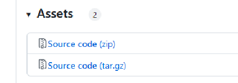

# Updating the TRUE Connector

## Table of Contents

* [Stop the TRUE Connector](<#stop-the-true-connector>)
* [Download new version](<#download-new-version>)
* [Configuring the new version](<#configuring-the-new-version>)
* [Restoring the previous data](<#restoring-the-previous-data>)

### Stop the TRUE Connector

To update the TRUE Connector to a newer version first stop the TRUE Connector with:

```
docker-compose down
```

This will shutdown the TRUE Connector and remove the containers but leave it's volumes with the data. If you wish to do a fresh upgrade then also unmount the volumes with:

```
docker-compose down -v
```

**CAUTION!**
This will delete all your data except be_dataapp_data_provider volume, since that one is made outside of the docker compose! Consider doing a [backup](backup.md) beforehand.

### Download new version

New versions of the TRUE Connector can be found [here](https://github.com/Engineering-Research-and-Development/true-connector/releases).

In the assets section you can choose to download it as a zip or tar.gz:



Unpack the folder and you are ready to configure it for your environment.

### Configuring the new version

The new versions will always be as a fresh start in that regard you have to configure it anew. Please follow the main README.md of the release that you downloaded.

### Restoring the previous data

If you have stopped with *docker-compose down*, the volumes of the previous version with the data are still there. Just start the TRUE Connector with:

```
docker-compose up -d
```

For restoring data from a backup please follow the [backup & restore guide](backup.md) .

**NOTE**
Future versions may be incompatible with each other and data migration must be done manually. That will be mentioned in the README.md .