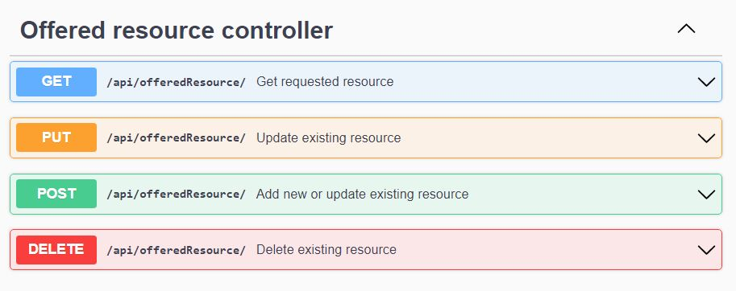
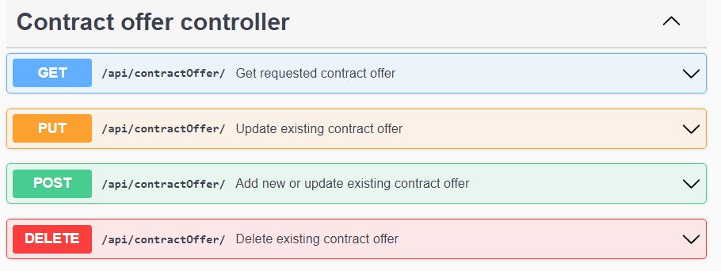
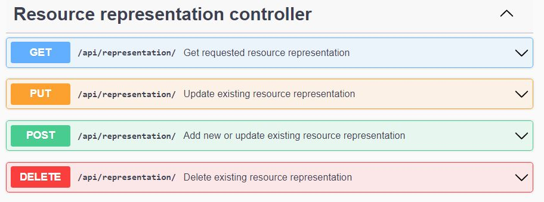

# REST API

The TRUE Connector will use two protocols (http and https) as described by the Docker Compose File.
Overview of all available endpoints:

*NOTE* Endpoints are protected with credentials, for more details, please check [this link](https://github.com/Engineering-Research-and-Development/true-connector-execution_core_container/blob/1.14.6/doc/SECURITY.md)

| **Method** |	**Endpoint** |	**Usage** |	**Returns** |
| ---------- |	------------ |	--------- |	----------- |
| POST | /proxy | Utility endpoint for starting communication | Response from provider connector |
| GET | / | Get connector self description | Connector |
| GET | /about/version | Return version of deployed ECC | - |
| GET | /notification/content/{hash} | Hash string from path variable | String |
| GET | /notification/password/{password} | Hash plain text password  | String |
| GET | /api/selfDescription/ | Self description document without validation | Connector |
| GET | /api/offeredResource/{resourceId} | Get requested resource | Resource |
| POST | /api/offeredResource/{catalogId} | Add new or update existing resource | Connector |
| PUT | /api/offeredResource/{catalogId} | Update existing resource | Connector|
| DELETE | /api/offeredResource/{resourceId} | Delete existing resource | Connector |
| GET | /api/representation/{representationId} | Get requested resource representation | Representation |
| POST | /api/representation/{resourceId} | Add new or update existing resource representation | Connector |
| PUT | /api/representation/{resourceId} | Update existing resource representation | Connector |
| DELETE | /api/representation/{representationId} | Delete existing representation | Connector |
| GET | /api/contractOffer/{contractOfferId} | Get requested contract offer | Representation |
| POST | /api/contractOffer/{resourceId} | Add new or update existing contract offer | Connector |
| PUT | /api/contractOffer/{resourceId} | Update existing contract offer | Connector |
| DELETE | /api/contractOffer/{representationId} | Delete existing contract offer | Connector |

Offered resources CRUD operations:

Contract offer CRUD operations:

Representation CRUD operations:

On following [link](https://github.com/Engineering-Research-and-Development/true-connector-execution_core_container/blob/1.14.6/doc/SELF_DESCRIPTION.md), you can find more detailed explanation of endpoints, with example requests.

