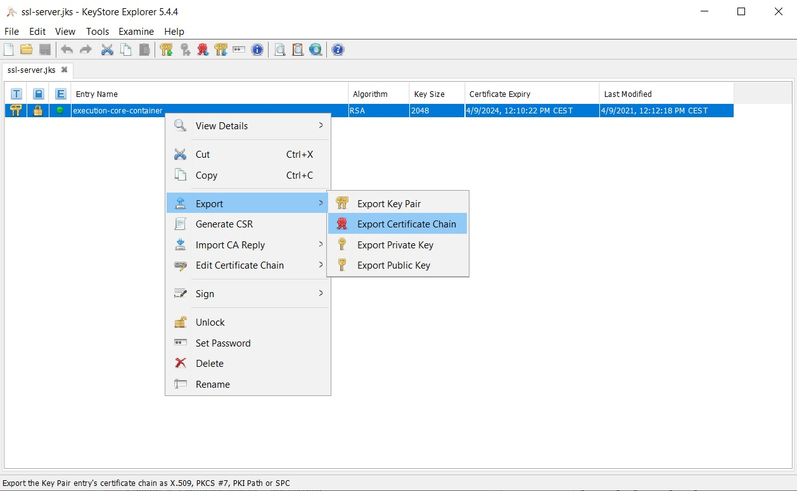
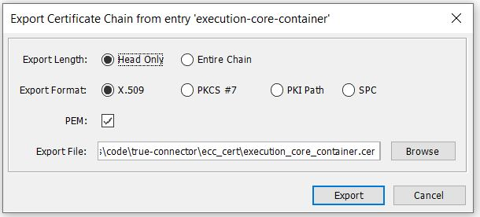
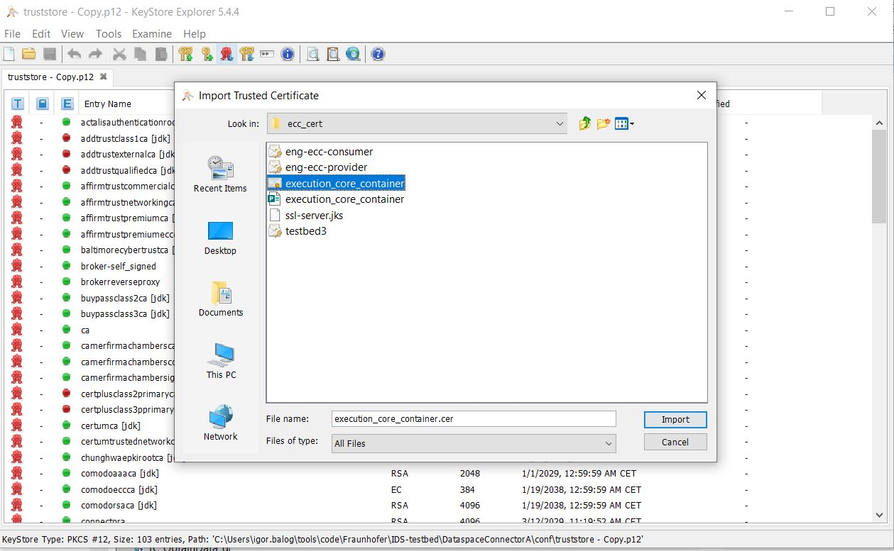
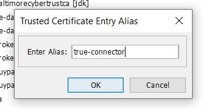
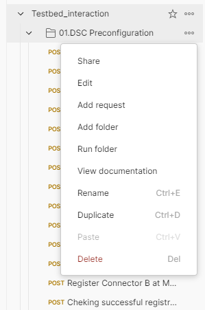
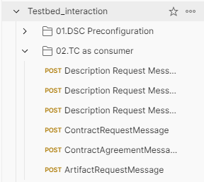
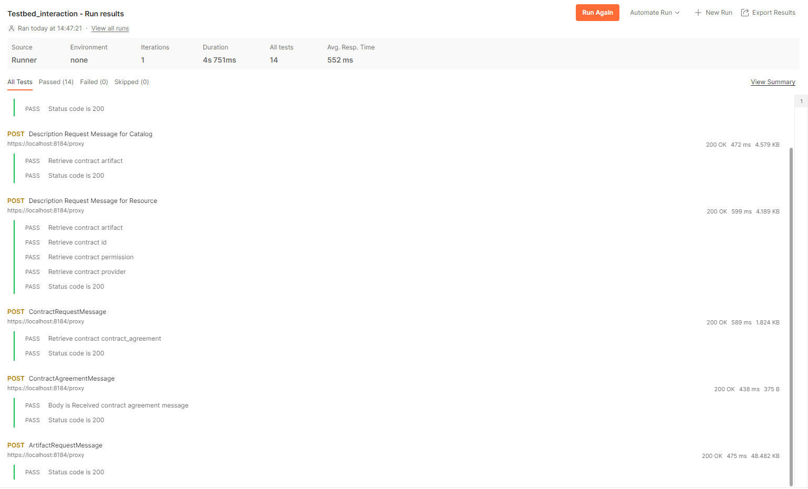
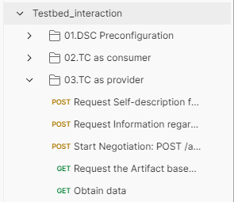
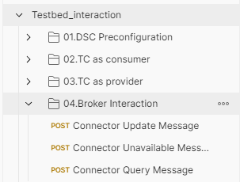
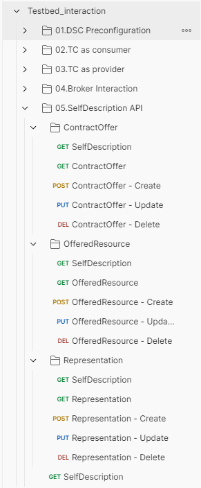

# Testbed 

For more information follow the link [Testbed](https://github.com/International-Data-Spaces-Association/IDS-testbed/tree/v1.1.0)

Clone or download this repo. Currently verified (supported) version of the Testbed is 1.1.0.

## Preconfigure

### Generate DAPS certificate using Omejdn DAPS

This step is not mandatory, since Testbed comes with some generated certificates which can be used.

If you want to create new certificate, please follow [instructions](https://github.com/International-Data-Spaces-Association/IDS-testbed/tree/v1.1.0/CertificateAuthority) provided by Testbed, on how to achieve this.


### DAPS certificate

You can use certificate already provided in Testbed project, in following location - *IDS-testbed\CertificateAuthority\data\cert\*
We need to make some small adjustments, to generate valid p12 file. For this purpose, we need to copy *ReferenceTestbedCA.crt* file from ca folder (one level above) and execute following command:

```
openssl pkcs12 -export -out testbed3.p12 -inkey testbed3.key -in testbed3.crt -certfile ReferenceTestbedCA.crt
```
As Export password insert ***password***, and confirm it.


This will generate valid testbed3.p12 file. Copy this file to trueconnector\ecc_cert folder.

**Note:** If you using Linux OS, after coping file, inside trueconnector\ecc_cert folder execute next command:
``chmod 666 testbed3.p12``

**Remark:** in DAPS, only testbed1, testbed2 and testbed3 files are registered, so we will use same testbed3.p12 file for both consumer and provider.


### TrueConnector properties

Make sure that following properties are configured for Testbed environment:

**.env** 

```
### PROVIDER Configuration
PROVIDER_DAPS_KEYSTORE_NAME=testbed3.p12
PROVIDER_DAPS_KEYSTORE_PASSWORD=password
PROVIDER_DAPS_KEYSTORE_ALIAS=1

PROVIDER_MULTIPART_EDGE=form

CONSUMER_DAPS_KEYSTORE_NAME=testbed3.p12
CONSUMER_DAPS_KEYSTORE_PASSWORD=password
CONSUMER_DAPS_KEYSTORE_ALIAS=1
```

(for the moment, we will use same DAPS certificate for both Provider and Consumer)

**application.properties** for both consumer and provider

```
application.isEnabledDapsInteraction=true

#Omejdn 
application.dapsUrl=http://omejdn/auth/token
application.dapsJWKSUrl=http://omejdn/auth/jwks.json

application.encodeDecodePayload=true

application.isEnabledUsageControl=true
application.usageControlVersion=platoon

```

**dataApp application.properties**

```
application.encodePayload=true
```

### Enabling hostname validation

In order to enable this functionality, following changes are required:

**.env** file 

```
DISABLE_SSL_VALIDATION=false

TRUSTORE_NAME=truststoreEcc.jks
TRUSTORE_PASSWORD=allpassword

```

This will load certificates from truststore and when making https call towards target system, certificate will be validated against truststore, and if certificate is present and valid, call will be successful, otherwise you will get PKIX exception.

### Docker networking

Since we are running 2 separate docker containers, one for Testbed and other for TrueConnector, we must connect those 2 environments, so that they could communicate, and "see each other". For example, DAPS is mandatory service, for both environments and it is deployed in Testbed docker container, and by default, not reachable in TrueConnector.

In Testbed docker setup, there is network created, in docker-compose.yml.

```
networks:
  local:
    driver: bridge
```

This network needs to be added in TrueConnector docker compose, so that 2 ecosystems can communicate with each other.</b>
Modify TrueConnector docker-compose.yml file by replacing the end of the file with the following:

```
networks:
  consumer:
   external: true
   name: testbed_local
  provider:
   external: true
   name: testbed_local

```

### Export TrueConnector certificate

Open *ssl-server.jks* file from TrueConnector/ecc_cert folder using KeyStore Explorer and export certificate (right click on entry name):



and provide location where to save exported certificate. It will be needed in next step, to update DSC truststore.



Or you can use already extracted *execution_core_container.cer* file from **ecc_cert** folder.

### Updating DSC truststore

Open DSC truststore file *truststore.p12* (IDS-testbed\DataspaceConnectorA\conf\ and IDS-testbed\DataspaceConnectorB\conf\) using KeyStore Explorer and import TrueConnector certificate, so that DSC can make https calls towards TrueConnector provider



and provide alias *true-connector*



This will be used when DSC makes https request towards ecc-provider, to check hostname with imported certificate.


## Testbed interaction

### DataspaceConnector preconfiguration

Once both docker compose files are up and running, you can start postman, import [Testbed postman connection](doc/testbed/Testbed_interaction.postman_collection) and execute several requests to setup DSC connector, easily done by clicking the three dots and "Run Folder":



This will create contract offer, resource and artifact into DSC ConnectorA (provider).

### TrueConnector as consumer

To perform contract negotiation with DataSpaceConnector and get an artifact. For this purpose, you can use 

You can execute the whole folder, same as before, or execute each request in that order.

If everything was successful, it should look like the following:




### TrueConnector as provider

TrueConnector comes with predefined Self Description document. You can get more information about it by expecting the document itself on URL:

```
https://localhost:8090/

```

Same goes as before, execute each request or the whole TC as provider folder:



### Broker interaction

The interaction with MetadataBroker can be checked with the requests from the Broker interaction folder in the same way as the steps from above.



### Self Description API

And finally, the Self Description API, for modifying the Self Description document can be accessed via the 




